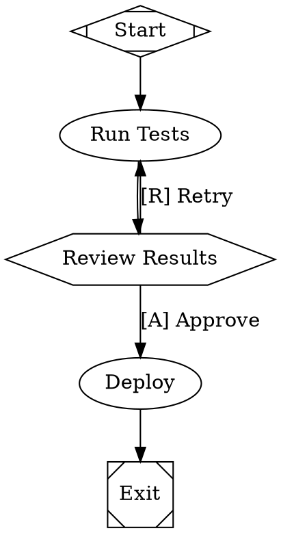
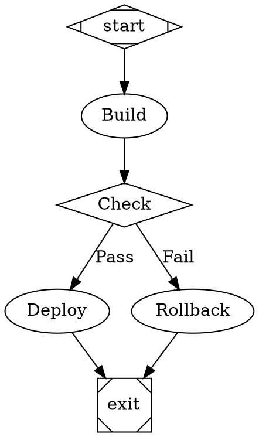
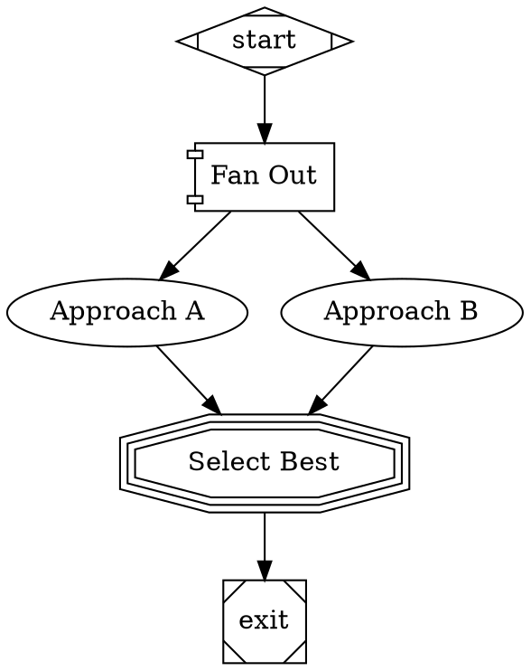
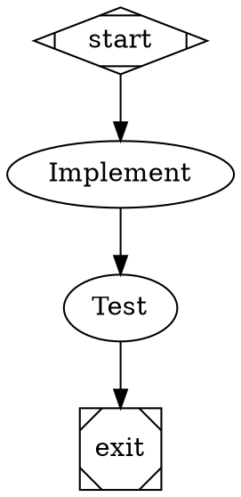
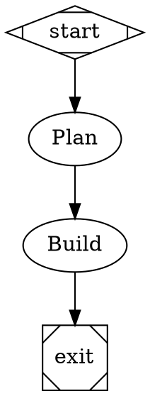

# Attractor

DOT-based workflow orchestration engine for AI-driven software development.

Define multi-stage AI pipelines as [Graphviz DOT](https://graphviz.org/doc/info/lang.html) files. Attractor parses them into directed graphs and executes them deterministically with LLM calls, human approval gates, conditional branching, parallel execution, retries, and checkpointing.

## Why DOT?

DOT is a decades-old, well-tooled graph description language. Using it for AI workflows gives you:

- **Visualization for free** -- render your pipeline with any Graphviz tool, IDE plugin, or `dot -Tpng`
- **Version control friendly** -- plain text diffs show exactly what changed in your workflow
- **No new DSL to learn** -- if you've seen a Graphviz diagram, you can read an Attractor pipeline
- **Separation of concerns** -- graph structure is declarative, execution is handled by the engine

## Installation

Add to your Gemfile:

```ruby
gem "attractor-rb"
```

Or install directly:

```sh
gem install attractor-rb
```

Requires Ruby >= 4.0.0.

### Runtime prerequisites

- `simulation` backend: no external CLI dependency
- `codex` backend: `codex` CLI must be installed, available on `PATH`, and authenticated
- `claude` backend: `claude` CLI must be installed, available on `PATH`, and authenticated
- Optional: Graphviz (`dot`) for rendering DOT files as diagrams

## Quick Start

**1. Define a pipeline** as a DOT file (`pipeline.dot`):



**2. Validate it:**

```sh
attractor validate pipeline.dot
```

**3. Dry-run with the simulation backend:**

```sh
attractor run pipeline.dot
```

This creates `./logs` by default with per-node prompts, responses, statuses, and a checkpoint file for resume.

**4. Execute with Codex:**

```sh
attractor run pipeline.dot --backend codex --interviewer console
```

**Claude compatibility (optional):**

```sh
attractor run pipeline.dot --backend claude --interviewer console
```

## How It Works

The engine processes a pipeline in five phases:

```
DOT source --> Parse --> Transform --> Validate --> Execute --> Outcome
```

1. **Parse** -- DOT source is tokenized and parsed into a `Graph` of typed nodes and edges
2. **Transform** -- variable expansion (`$goal`) and stylesheet application
3. **Validate** -- 13 lint rules check structural integrity before any execution
4. **Execute** -- nodes are traversed from `start` to `exit`, running the appropriate handler at each step
5. **Finalize** -- checkpoint is saved, completion event is emitted

After each node execution, the engine checkpoints state to disk. If a run fails or is interrupted, pass `--resume` to continue from where it left off.

## Node Types

Node behavior is determined by the DOT `shape` attribute:

| Shape | Type | Purpose |
|---|---|---|
| `Mdiamond` | start | Entry point. Every graph needs exactly one. |
| `Msquare` | exit | Terminal node. Triggers goal gate checks. |
| `box` | codergen | Sends a prompt to the configured LLM backend. |
| `diamond` | conditional | Branch point. Outgoing edges carry conditions for routing. |
| `hexagon` | wait.human | Pauses for human input. Choices come from outgoing edge labels. |
| `component` | parallel | Fan-out. Executes outgoing branches concurrently. |
| `tripleoctagon` | parallel.fan_in | Fan-in. Selects the best result from parallel branches. |
| `parallelogram` | tool | Runs a shell command via `tool_command` attribute. |
| `house` | stack.manager_loop | Polls child process status in a loop. |

## Examples

### Conditional Branching

Route execution based on outcome or context values:



### Parallel Fan-Out / Fan-In

Run multiple approaches concurrently and pick the best:



Fan-out supports `join_policy` (`wait_all` or `first_success`) and `max_parallel` (default: 4).

### Human Approval Gates

Pause for operator input with accelerator keys:

```dot
review [shape=hexagon, label="Review Changes"]

review -> deploy [label="[A] Approve"]
review -> fix    [label="[F] Request Fixes"]
review -> abort  [label="[X] Abort"]
```

Accelerator formats: `[K] Label`, `K) Label`, or `K - Label`.

With `--interviewer console`, the operator selects interactively. With `auto_approve` (default), the first option is always selected.

### Goal Gates and Retries

Mark critical nodes as quality checkpoints. If a goal gate fails, the engine retries from an earlier node:



### Model Stylesheets

Decouple LLM configuration from graph structure with a CSS-like DSL:



Selectors: `*` (all nodes), `#node_id` (by ID), `.class-name` (by class).

## CLI Reference

### `attractor run DOTFILE`

| Option | Default | Description |
|---|---|---|
| `--logs-root` | `./logs` | Directory for logs, artifacts, and checkpoints |
| `--backend` | `simulation` | LLM backend: `simulation`, `codex`, or `claude` |
| `--interviewer` | `auto_approve` | Human gate mode: `auto_approve` or `console` |
| `--resume` | `false` | Resume from last checkpoint |

### `attractor validate DOTFILE`

Validate a pipeline without executing it. Reports errors, warnings, and info diagnostics. Exits non-zero if errors are found.

### Codex Backend Configuration

`Attractor::Backends::CodexBackend` supports a minimal environment-based configuration surface:

- `ATTRACTOR_CODEX_MODEL` -- passed as `codex exec --model`
- `ATTRACTOR_CODEX_PROFILE` -- passed as `codex exec --profile`
- `ATTRACTOR_CODEX_SANDBOX` -- passed as `codex exec --sandbox` (ignored when dangerous bypass is enabled)
- `ATTRACTOR_CODEX_FULL_AUTO` -- enables/disables `--full-auto` (default: enabled)
- `ATTRACTOR_CODEX_DANGEROUS_BYPASS` -- enables `--dangerously-bypass-approvals-and-sandbox` (default: disabled)
- `ATTRACTOR_CODEX_TIMEOUT` -- backend timeout in seconds (default: `300`)

The backend invokes `codex exec --output-last-message` and records only the final assistant message in node response artifacts.

## Run Artifacts

Each run writes files under `--logs-root` (default `./logs`):

- `manifest.json` -- run metadata (`name`, `goal`, start timestamp)
- `checkpoint.json` -- resumable engine state
- `<node_id>/prompt.md` -- rendered prompt sent to the backend (LLM nodes)
- `<node_id>/response.md` -- backend response (LLM nodes)
- `<node_id>/status.json` -- normalized `Outcome` for the node

For `tool` nodes, commands run via `Bundler.with_unbundled_env` to avoid leaking parent Bundler/Gemfile context into subprocesses.

## Programmatic Usage

```ruby
require "attractor"

backend = Attractor::Backends::CodexBackend.new(timeout: 600)
interviewer = Attractor::Interviewer::Console.new

engine = Attractor::Engine.new(
  backend: backend,
  interviewer: interviewer
)

outcome = engine.run(File.read("pipeline.dot"), logs_root: "./logs")

if outcome.success?
  puts "Pipeline completed: #{outcome.notes}"
else
  puts "Pipeline failed: #{outcome.failure_reason}"
end
```

### Events

Subscribe to execution events for monitoring or logging:

```ruby
engine = Attractor::Engine.new(backend: backend)

engine.event_emitter.on_event do |event|
  case event
  when Attractor::Events::StageStarted
    puts "Starting: #{event.name}"
  when Attractor::Events::StageCompleted
    puts "Completed: #{event.name} (#{event.duration.round(2)}s)"
  when Attractor::Events::StageFailed
    puts "Failed: #{event.name} -- #{event.error}"
  end
end
```

### Custom Backends

Implement `Attractor::CodergenBackend`:

```ruby
class MyBackend < Attractor::CodergenBackend
  def run(node, prompt, context)
    # Call your LLM, return response text
    MyLLMClient.complete(prompt)
  end
end
```

### Custom Lint Rules

Add project-specific validation:

```ruby
class NoTodoPromptsRule < Attractor::LintRules::BaseRule
  def name = "no_todo_prompts"

  def apply(graph)
    graph.nodes.values.filter_map do |node|
      next unless node.prompt.include?("TODO")

      Attractor::Diagnostic.new(
        rule: name,
        severity: Attractor::Diagnostic::SEVERITY_ERROR,
        message: "Node '#{node.id}' has a TODO in its prompt",
        node_id: node.id
      )
    end
  end
end

engine = Attractor::Engine.new(extra_rules: [NoTodoPromptsRule.new])
```

## Validation Rules

The validator runs 13 built-in rules before execution:

| Rule | Severity | What it checks |
|---|---|---|
| `StartNodeRule` | error | Exactly one start node exists |
| `TerminalNodeRule` | error | At least one exit node exists |
| `ReachabilityRule` | error | All nodes are reachable from start |
| `EdgeTargetExistsRule` | error | All edge targets reference existing nodes |
| `StartNoIncomingRule` | error | Start node has no incoming edges |
| `ExitNoOutgoingRule` | error | Exit nodes have no outgoing edges |
| `ConditionSyntaxRule` | error | Edge conditions are valid expressions |
| `StylesheetSyntaxRule` | error | Model stylesheet blocks parse correctly |
| `TypeKnownRule` | warning | Node types match a registered handler |
| `FidelityValidRule` | warning | Fidelity values are recognized |
| `RetryTargetExistsRule` | error | Retry targets reference existing nodes |
| `GoalGateHasRetryRule` | warning | Goal gate nodes have a retry target |
| `PromptOnLlmNodesRule` | warning | LLM nodes have a prompt attribute |

## Security

**Do not run untrusted DOT files.** Pipelines can execute arbitrary shell commands (via `tool` nodes) and make LLM API calls. Treat DOT pipeline files with the same trust level as Makefiles, CI configs, or shell scripts.

## Development

```sh
git clone https://github.com/aliciapaz/attractor-rb.git
cd attractor-rb
bundle install
bundle exec rspec        # run tests
bundle exec standardrb   # lint
```

## Contributing

Bug reports and pull requests are welcome on [GitHub](https://github.com/aliciapaz/attractor-rb).

1. Fork the repo
2. Create your branch (`git checkout -b feature/my-change`)
3. Make your changes with tests
4. Ensure `bundle exec rspec` and `bundle exec standardrb` pass
5. Open a pull request

## License

Released under the [MIT License](LICENSE).
